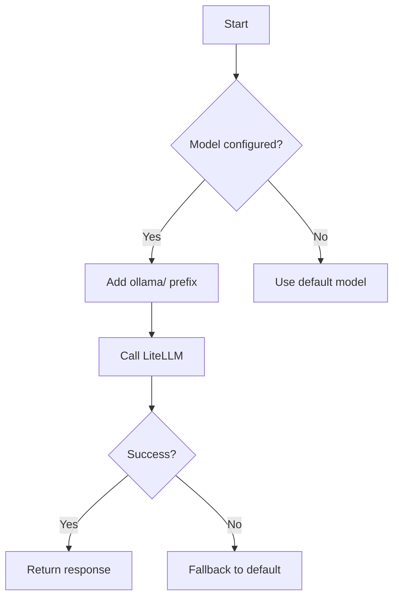

# Plan to Resolve litellm.BadRequestError for Ollama Models

## Problem Description
When running main.py with model 'qwen2.5:14b', we get:
```
litellm.BadRequestError: LLM Provider NOT provided. Pass in the LLM provider you are trying to call.
```

## Root Cause Analysis
1. The model is configured in config.toml without provider prefix
2. Current implementation in inference.py already includes:
   - custom_llm_provider="ollama" parameter
   - Model name formatted as "ollama/" + model_name
3. The error persists because:
   - The model name may not be properly prefixed in all cases
   - The model might not be installed in Ollama

## Solution Approach

### 1. Verify Ollama Setup
```bash
ollama list  # Check if qwen2.5:14b is installed
ollama pull qwen2.5:14b  # Install if missing
```

### 2. Code Modifications Required
Update the model name handling in inference.py to ensure:
1. Consistent provider prefixing
2. Better error handling for missing models



### 3. Implementation Steps
1. Update model name handling in LLM class initialization
2. Add model verification method
3. Implement fallback mechanism

## Verification Plan
1. Run `python main.py` with test prompts
2. Check logs for successful model initialization
3. Verify response quality matches expectations

## Troubleshooting
If errors persist:
1. Check Ollama service is running: `ollama serve`
2. Verify model name spelling
3. Test with simpler model (e.g., llama2)